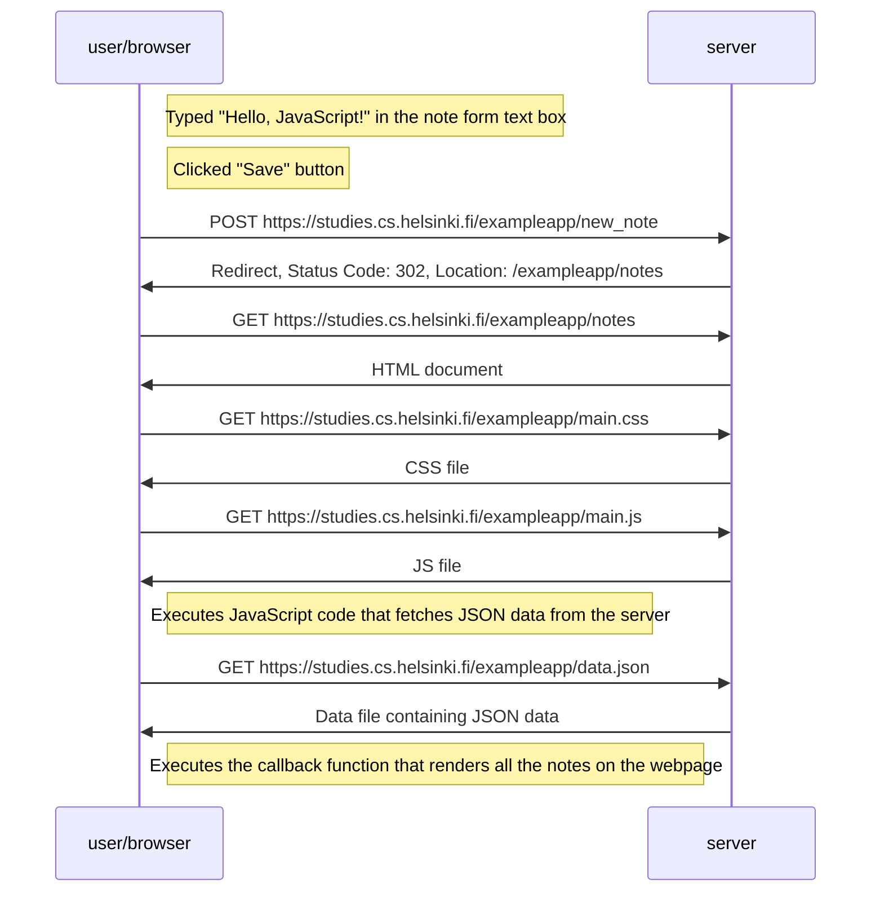

```mermaid
sequenceDiagram
    participant u as user/browser
    participant s as server

    note right of u: Typed "Hello, JavaScript!" in the note form text box
    note right of u: Clicked "Save" button

    u->>s: POST https://studies.cs.helsinki.fi/exampleapp/new_note
    s->>u: Redirect, Status Code: 302, Location: /exampleapp/notes

    u->>s: GET https://studies.cs.helsinki.fi/exampleapp/notes
    s->>u: HTML document

    u->>s: GET https://studies.cs.helsinki.fi/exampleapp/main.css
    s->>u: CSS file

    u->>s: GET https://studies.cs.helsinki.fi/exampleapp/main.js
    s->>u: JS file

    note right of u: Executes JavaScript code that fetches JSON data from the server

    u->>s: GET https://studies.cs.helsinki.fi/exampleapp/data.json
    s->>u: Data file containing JSON data

    note right of u: Executes the callback function that renders all the notes on the webpage
```
