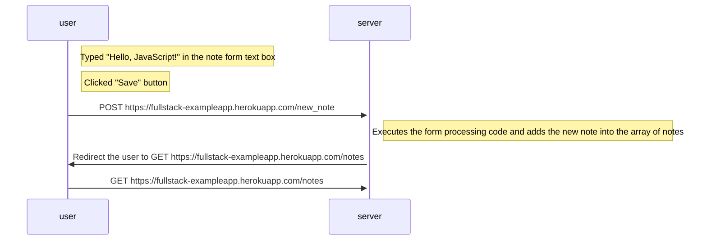

```mermaid
sequenceDiagram
    participant u as user
    participant s as server

    note right of u: Typed "Hello, JavaScript!" in the note form text box
    note right of u: Clicked "Save" button

    u->>+s: POST https://fullstack-exampleapp.herokuapp.com/new_note

    note right of s: Executes the form processing code and adds the new note into the array of notes

    s->>u: Redirect the user to GET https://fullstack-exampleapp.herokuapp.com/notes
    u->>s: GET https://fullstack-exampleapp.herokuapp.com/notes
```
