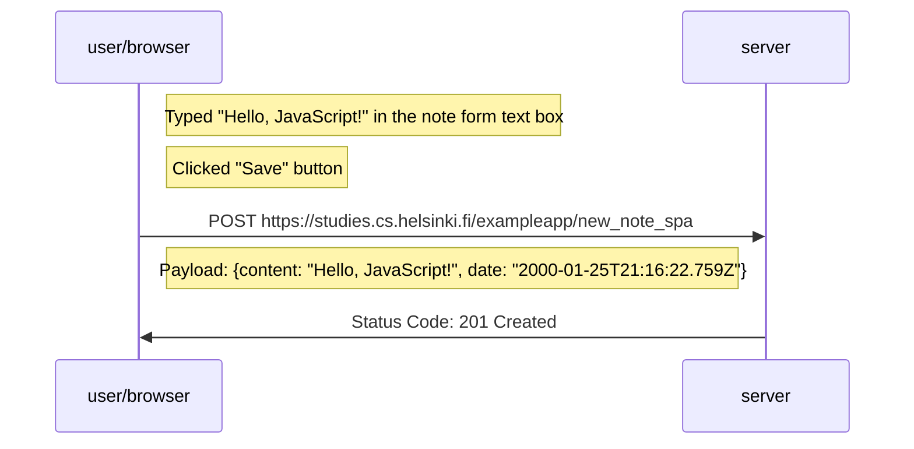

```mermaid
sequenceDiagram
    participant u as user/browser
    participant s as server

    note right of u: Typed "Hello, JavaScript!" in the note form text box
    note right of u: Clicked "Save" button

    u->>s: POST https://studies.cs.helsinki.fi/exampleapp/new_note_spa

    note right of u: Payload: {content: "Hello, JavaScript!", date: "2000-01-25T21:16:22.759Z"}
    s->>u: Status Code: 201 Created
```
